# Receptive field research

[experiments log](./markdown_site/expereiments_log.md)  
  
The research is about understanding of dependence between fully convolutional neural net depth and receptive field size. A lot of experiments were done to find the dependence. See full [experiments log](markdown_site/expereiments_log.md) for details.  
  
#### 1. What is the receptive field?
The concept came from biology:  
[wikipedia: receptive field: In the context of neural networks](https://en.wikipedia.org/wiki/Receptive_field#In_the_context_of_neural_networks).  
The fully convolutional neural net input is image. Output is image or images too.  
Let select a pixel on the output image (blue, see image below). Only limited set of pixel (red) on the input image can influence the selected pixel.  
  
  
  
This region of red pixels is the receptive field.   
Size of this filed is important in detection tasks.  
The object to be detected should be within this field.  
Otherwise some important features of the object will be outside the field and will be not used.  
So quality of the detection can get worse.  

#### 2. Theoretical receptive field size, naive  
Let see a convolutional layer. It consist of convolutions.  
Let see a kernel of size s. It can shift a pixel at half size of the kernel at the maximum:  
  
   
  
maximal shift is (s - 1) / 2
for 3x3 kernel: (3 - 1) / 2 = 1   
If we have sequence of N 3x3 convolution layers then maximal shift will be:  
N * (s - 1) / 2 = N  
So field size increase as O(N) with number of layers.  
As we can have pooling layers in the net then featuremaps resolution decrease.  
It can be considered as increasing pixels sizes.  
So if we have convolution layer after first 2x2 polling layer then size of the convolution layer should be increase in 2 times.  
And the maximal shift will be (2 * s - 1) / 2

#### 3. Theoretical receptive field size
It can be shown that field size increase as O(sqrt(N)) with number of layers.  
Let consider 1d case.
Convolution is used in probability distribution:  
[wikipedia: Convolution of probability distributions](https://en.wikipedia.org/wiki/Convolution_of_probability_distributions)    
So let consider the kernel as a distribution.  
Let the convolution kernel have all elements are positive numbers.    
Let we have N successive convolutions of size s.
So the final distribution is convolution of convolutions of convolutions etc.  
According to the wikipedia article the final distribution is distribution of sum of random variables.  
Form the other had we have [central limit theorem](https://en.wikipedia.org/wiki/Central_limit_theorem)  
It says that the distribution of sum is normal distribution with parameters:  
expected value: mu = sum(mu_i)  
variance: sigma^2 = sum(sigma_i^2)  
Let considered that elements of the kernels has no special shifts so mu_i = 0
Size of the kernel is 3x3 so sigma_i = 3  
Then size of the final distribution is sqrt(sigma^2) = sigma = sqrt(sum(3^2)) = O(sqrt(N))  
Please note: there is no any random variables inside the convolution.  
Theory of probability was used just to get the final O(sqrt(N)).  
In case of the net with pool we need to increase kernel sizes.  
For example we have a net: 3x3 convolution - 2x2 pool - 3x3 convolution, then we need to use:  
```sqrt(3^2 + (3*2)^2)```  
here we have 3*2 because after pooling featuremaps has decreased in 2 times resolution.  
Another way to get O(sqrt(N)):  
Let we have net of convolutional N layers with fixed kernel size.  
Then degrees of freedom is O(N).
To encode a field size R we need to have degrees of freedom O(R^2).
Thus R^2 = O(N) or R = O(sqrt(N))   
  
#### 4. e dataset and no pooling net  
A set of experiments was think out to check the theoretical field size.
Fully convolutional neural net was used. For simplicity, it has no pooling layers.  
The code of the net: [no_pools_net_res.py](./nets/no_pools_net_res.py)  
Special synthetic dataset was used:  
It can be considered as OCR task (optical character recognition) with only 2 possible letters:  
е  
ё  
Russian letter е can have diaeresis. The diaeresis is double dot above the letter.  
Russian е with the diaeresis is another letter.  
e always has fixed position in the center of the image.  
Distance between e and the diaeresis is adjustable.  
It is detection task. The task is to find center of e.  
There are 2 featuremaps on the output of the nets.  
One for е and one for ё.  
Center of the letter encoded with small gaussian spot.  
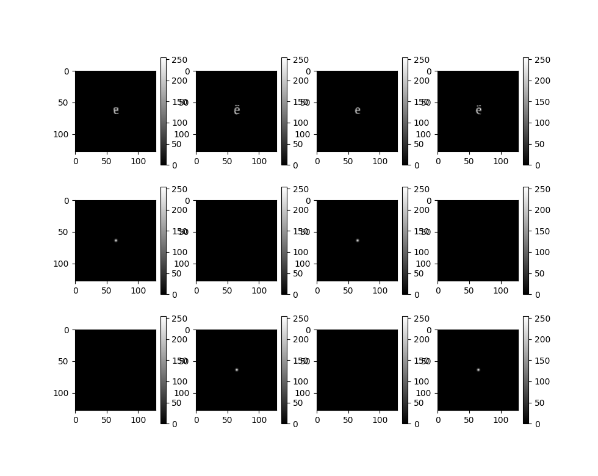   
First row is input image, second row is featuremap for е, third row is featuremap for ё.  
Bigger distance:
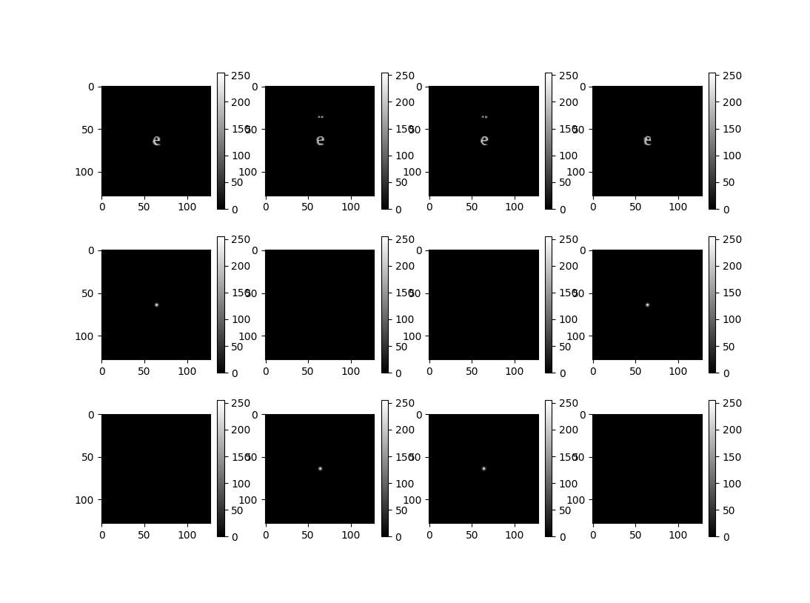   
The task of the net is to predict to right spot.  
How the е/ё decission is made:  
if mean value of small area in the center of the output е-featuremap is higher
than in ё-featuremap then it is e symbol, ё otherwise.  
Accuracy is calculated.   
Accuracy is number of correct answers divided by number of all answers.   
If the receptive field size of the net will be too small, than the accuracy expected to be close to 0.5 (random guess).  
If the size is high enough then the accuracy is close to 1.0.  
That is how the receptive field size can be found:  
we can scan distance to diaeresis until the accuracy drops from 1.0 to 0.5.  
The dataset code: [e_symbol_dataset.py](./dataset_generator/e_symbol_dataset.py)  
There are more difficult dataset also:  
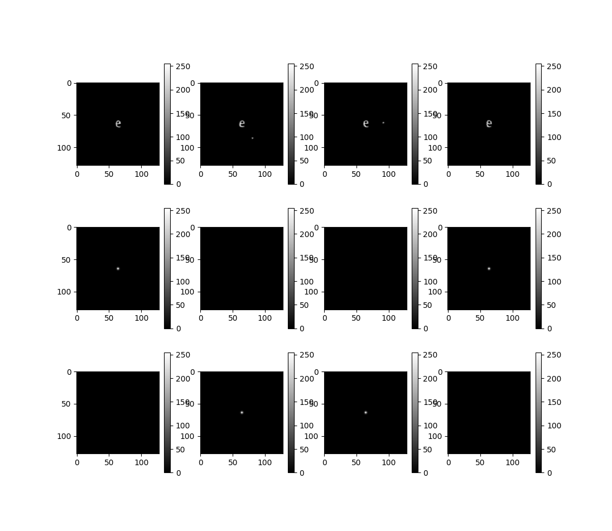  
Here the diaeresis is a dot.  
And the dot can be at any place around the e at fixed predefined distance.
The dataset code: [e_symbol_dot_dataset.py](./dataset_generator/e_symbol_dot_dataset.py)  
This dataset has higher variability.  
Small scale elastic augmentation are used in all datasets, see: [augmentator.py](./dataset_generator/augmentator.py)  

  
#### 5. Get O(sqrt(N)) by experiment.  
Neural net with no pool layers was used and with residual connections:  
[no_pools_net_res.py](./nets/no_pools_net_res.py)  
convolutional layer kernel size: 3x3  
number of intermidiate featuremaps: 16
Weight initialization was xavier. 
e-symbol dataset with diaeresis was used: [e_symbol_dataset.py](./dataset_generator/e_symbol_dataset.py)        
experiemnt code: [experiment_field_size_vs_depth_res.py](./experiments/experiment_field_size_vs_depth_res.py)  
result:      
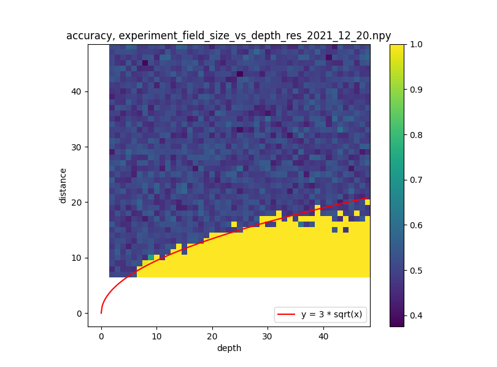  
depth is number of convolutional layers.  
distance is distance between e and the diaeresis.  
receptive field size is O(sqrt(N))
  
#### 6. Get O(N) by experiment, with special initial condition.  
The same net and dataset like in [point 5](#5-get-osqrtn-by-experiment) but another weights initial condition:  
Each kernel has xavier initial condition only for the upper row of the kernel.  
All rest elements of the kernel is close to 0.  
Thus each kernel have 1 pixel shift up closer to the diaeresis.  
In the theory mu = sum(mu_i) is not zero but O(N).  
So we expect that it can detect at O(N) distance.   
Script: [experiment_field_size_vs_depth_res.py](./experiments/experiment_field_size_vs_depth_res.py)  
with is_shifted_init=True      
Result:  
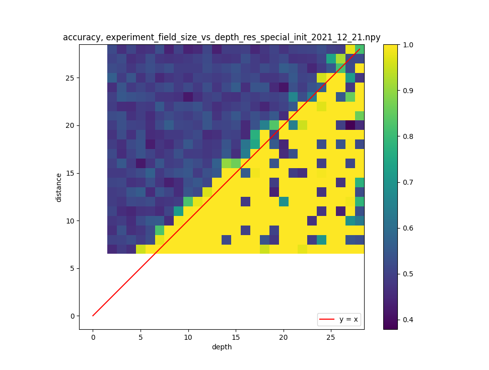  
The distance is O(N) as expected. 

#### 7. Estimate field size before train.  
There are pool layers in a real net.  
Thus filed size dependency is more complex than O(sqrt(N))  
So we need a way to estimate the field size.  
Let's check this with no-pool net.  
Input image is image where all pixels values is 0 except one pixel in the center of the image.  
It has value 1.
We set all kernel values to positive constant 0.01.  
All bias are set to 0.  
Thus ReLUs has no influence.  
Then we make the forward pass and get output image with blurred spot:
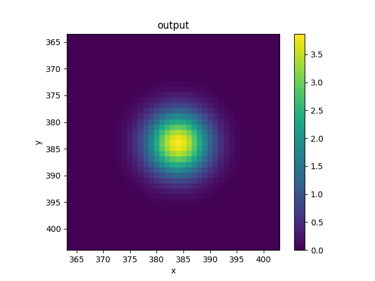  
The size of the blurred spot is the estimation for the receptive field size.  
Thus we can scan the estimated field size with net done.   
See [experiment_field_size_by_forward_pass_constant.py](./experiments/experiment_field_size_by_forward_pass_constant.py)  
Result:  
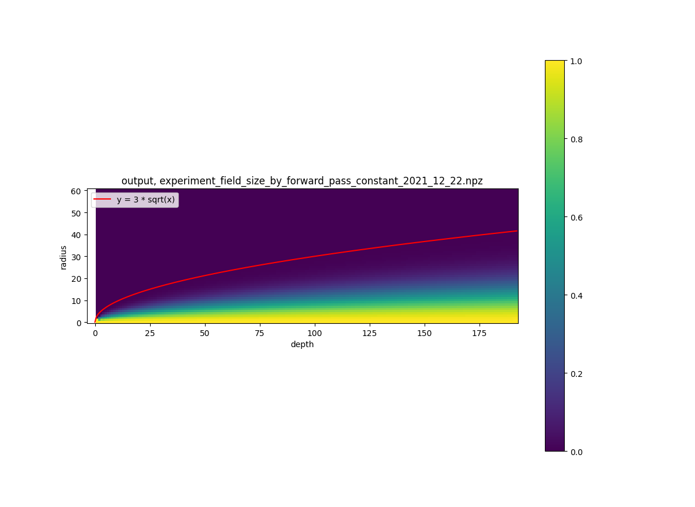  
In this picture along y axis we have radial profile of the blurred spot.  
The value along y = 3 * sqrt(x) curve is about 0.0012.   
We get the same sqrt dependency with xavier weights:
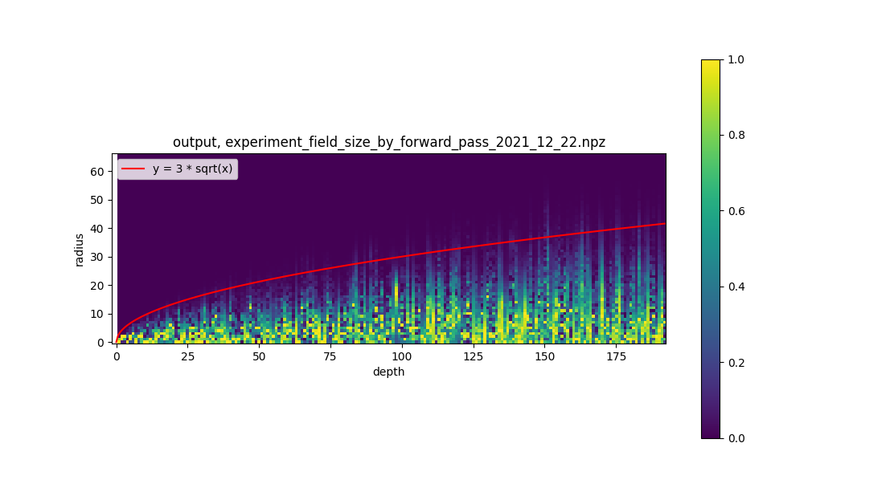
See [experiment_field_size_by_forward_pass.py](./experiments/experiment_field_size_by_forward_pass.py)  

#### 8. Check field size estimation for ResNet50.  
Let estimate the receptive field size for the ResNet50 and then check it by experiment.  
Let set all kernel values to 0.01. Biases are set to 0.
Batch norm linear coefficients to 1.0., shift to 0.  
Result:  
Output:  
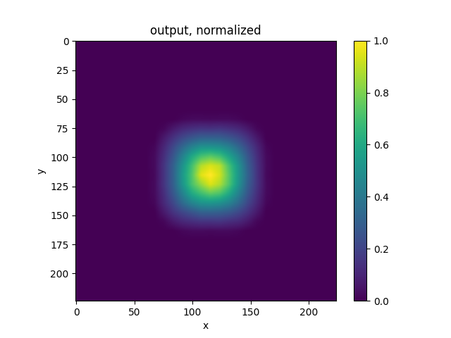  
Output radial profile:  
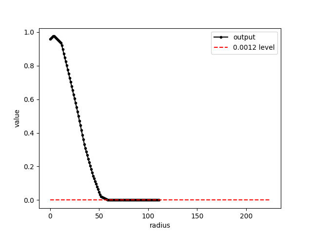  
field radius at 0.0012 level is 59 pixels  
See script: [experiment_field_size_resnet50_by_forward_pass.py](./experiments/experiment_field_size_resnet50_by_forward_pass.py)   
Now let get field size experimentally with the e-dataset:
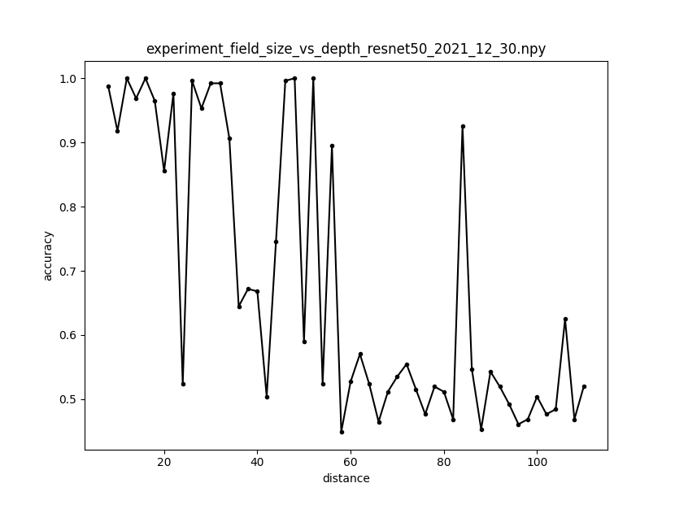    
Field size radius is about 60 pixels, but it has nonzero probability to be trained at bigger radius.  
See script: [experiment_field_size_resnet50.py](./experiments/experiment_field_size_resnet50.py)  
In total estimation (59) is close to experimental value (60).  
  
#### 9. Tries to get field size bigger then O(sqrt(N)) by special initial conditions.
In [point 6](#6-get-on-by-experiment-with-special-initial-condition) we got O(N) for e-dataset.  
Here we had initial conditions with mu_i is not zero.  
We know that diaeresis is placed above e. So we made up shift.  
What if we have a feature that can be in a random place of a region?  
I tried to make universal initial conditions that can have receptive field size bigger than O(sqrt(N)).
##### Decomposed initial condition
If we set biases to 0 and intermediate featuremaps has all positive values then ReLU has no influence.  
In this case sequence of convolutions can be considered as one convolution of a bigger size.  
For example N 3x3 convolutions is one ```(2*N + 1) x (2*N + 1)``` convolution.
Let this big convolution has all elements equal to 1.0.  
What sequence of 3x3 convolutions is equal to this big convolution?  
The answer if follow:  
```text
kernel = [[1               -2*cos(k*phi)     1            ]
          [-2*cos(k*phi)   4*cos(k*phi)**2   -2*cos(k*phi)]
          [1               -2*cos(k*phi)     1            ]]
``` 
where 
```k = 1..N - index number of a 3x3 kernel```  
```phi = 2*pi / (2*N+1)```  
In the [formulas page](./markdown_site/formulas_page.md) you can get the way how I got the formula.  
I set this initial condition and got O(N) for forward pass before train:
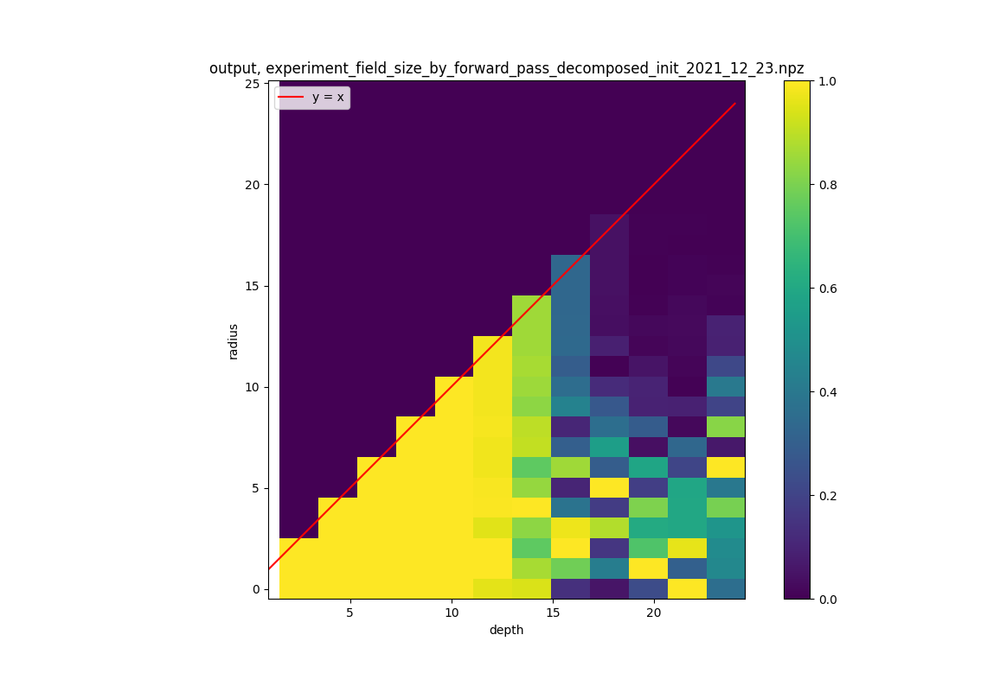  
x-axis: net depth, numbner of convolution layers  
y-axis: radial profile of the spot.      
code: [experiment_field_size_vs_depth_res_decomposed_init.py](./experiments/experiment_field_size_vs_depth_res_decomposed_init.py)  
initializer: [initializers.py/decomposed_init](./initializers.py#L5)  
The radial profile is constant as expected.      
O(N) - as expected.  
But we have instability at depth about 12.
This is because float32 precision used. It is not enough for depth 12 and more.  
The calculation error is accumulated from layer to layer.  
Formulas are correct.  
Also I trained the net with this initial condition and with e-dataset and got no result:  
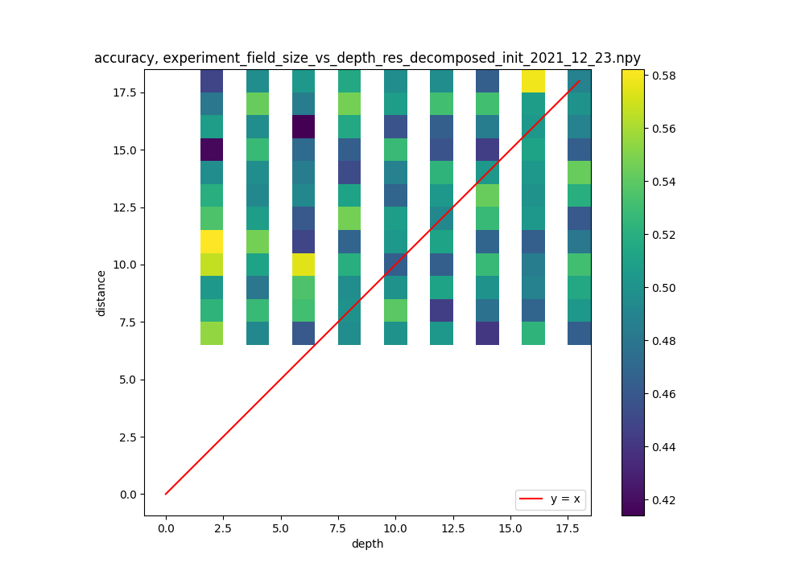  
no recognition at all, all accuracies is about 0.5  
code: [experiment_field_size_vs_depth_res_decomposed_init.py](./experiments/experiment_field_size_vs_depth_res_decomposed_init.py)  
Thus this initial condition doesn't help.  
##### Circular initial condition  
  
In this experiment I used dot dataset  
[e_symbol_dot_dataset.py](./dataset_generator/e_symbol_dot_dataset.py)  
See [point 4](#4-e-dataset-and-no-pooling-net)  
In this dataset the dot can be at any angle from 0 to 360 degrees.  
Thus we don't know where is the dot.
So we need to make shifts in kernels all directions.  
Convolutional layer has 16 input featuremaps and 16 output featuremap. 
We can consider the net as 16 nets that goes in parallel.  
Each net or data path serves shift at specific angle.  
All 360 degrees was divided at 16 rays.  
One 3x3 kernel can make only 8 possible shifts:  
dx = 1   dy = 0  
dx = 1   dy = 1  
dx = 0   dy = 1  
dx = -1   dy = 1  
dx = -1   dy = 0  
dx = -1   dy = -1  
dx = 0   dy = -1  
dx = 1   dy = -1  
If we have N 3x3 kernels we can make shift along ray that goes at any angles.    
See the intializer code:  [initializers.py/circular_init](./initializers.py#L52)  
It use np.rand and np.diff.  
The task is similar to [line drawing algorithm](https://en.wikipedia.org/wiki/Line_drawing_algorithm).  
todo: describe comparizon fo two picures  
 
  
   
    
  

  


  

 

  


     
