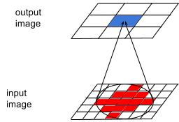
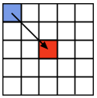

# Receptive field research

[experiments log](./markdown_site/expereiments_log.md)  
  
The research is about understanding of dependence between fully convolutional neural net depth and receptive field size. A lot of experiments were done to find the dependence. See full [experiments log](markdown_site/expereiments_log.md) for details.  
  
#### 1. What is the receptive field?
The concept came from biology:  
[wikipedia: receptive field: In the context of neural networks](https://en.wikipedia.org/wiki/Receptive_field#In_the_context_of_neural_networks).  
The fully convolutional neural net input is image. Output is image or images too.  
Let select a pixel on the output image (blue, see image below). Only limited set of pixel (red) on the input image can influence the selected pixel.  
  
  
  
This region of red pixels is the receptive field.   
Size of this filed is important in detection tasks.  
The object to be detected should be within this field.  
Otherwise some important features of the object will be outside the field and will be not used.  
So quality of the detection can get worse.  

#### 2. Theoretical receptive field size, naive  
Let see a convolutional layer. It consist of convolutions.  
Let see a kernel of size s. It can shift a pixel at half size of the kernel at the maximum:  
  
   
  
maximal shift is (s - 1) / 2
for 3x3 kernel: (3 - 1) / 2 = 1   
If we have sequence of N 3x3 convolution layers then maximal shift will be:  
N * (s - 1) / 2 = N  
So field size increase as O(N) with number of layers.  
As we can have pooling layers in the net then featuremaps resolution decrease.  
It can be considered as increasing pixels sizes.  
So if we have convolution layer after first 2x2 polling layer then size of the convolution layer should be increase in 2 times.  
And the maximal shift will be (2 * s - 1) / 2

#### 3. Theoretical receptive field size
It can be shown that field size increase as O(sqrt(N)) with number of layers.  
Let consider 1d case.
Convolution is used in probability distribution:  
[wikipedia: Convolution of probability distributions](https://en.wikipedia.org/wiki/Convolution_of_probability_distributions)    
So let consider the kernel as a distribution.  
Let the convolution kernel have all elements are positive numbers.    
Let we have N successive convolutions of size s.
So the final distribution is convolution of convolutions of convolutions etc.  
According to the wikipedia article the final distribution is distribution of sum of random variables.  
Form the other had we have [central limit theorem](https://en.wikipedia.org/wiki/Central_limit_theorem)  
It says that the distribution of sum is normal distribution with parameters:  
expected value: mu = sum(mu_i)  
variance: sigma^2 = sum(sigma_i^2)  
Let considered that elements of the kernels has no special shifts so mu_i = 0
Size of the kernel is 3x3 so sigma_i = 3  
Then size of the final distribution is sqrt(sigma^2) = sigma = sqrt(sum(3^2)) = O(sqrt(N))  
Please note: there is no any random variables inside the convolution.  
Theory of probability was used just to get the final O(sqrt(N)).  
  
#### 4. e dataset and no pooling net  
A set of experiments was think out to check the theoretical field size.
Fully convolutional neural net was used. For simplicity, it has no pooling layers.  
Special synthetic dataset was used:  
It can be considered as OCR task (optical character recognition) with only 2 possible letters:  
е  
ё  
   
  

     
