# Experiments log
accuracy - number of correct unswers devided by number of answers  
depth - depth of a neural net, number of convolutional layers  
distance - distance in pixels from center of the input image where e symbol is paced and diaeresis  
white color - no data  
  
#### 1. No residual connection net  
convolutional layer kernel size: 3x3  
number of intermidiate featuremaps: 16     
[experiment_field_size_vs_depth.py](../../experiments/experiment_field_size_vs_depth.py)    
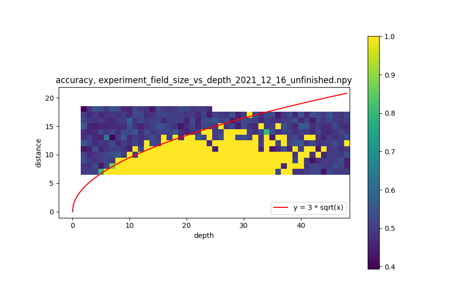  
receptive field size is O(sqrt(N)), where N is number of layers  
after depth = 40 train are not stable probably because of [vanishing gradient problem](https://en.wikipedia.org/wiki/Vanishing_gradient_problem)  
    
#### 2. Residual connections net
convolutional layer kernel size: 3x3  
number of intermidiate featuremaps: 16     
[experiment_field_size_vs_depth_res.py](../../experiments/experiment_field_size_vs_depth_res.py)    
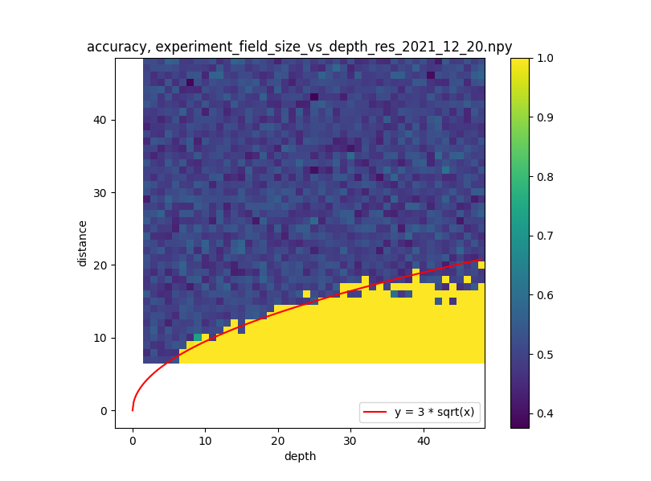  
receptive field size is O(sqrt(N))  
    
#### 3. Special initial condition
each kernel has xavier initial condition only for the upper row of the kernel. All rest elements of the kernel is close to 0  
convolutional layer kernel size: 3x3  
number of intermidiate featuremaps: 16     
[experiment_field_size_vs_depth_res.py](../../experiments/experiment_field_size_vs_depth_res.py)    
is_shifted_init=True  
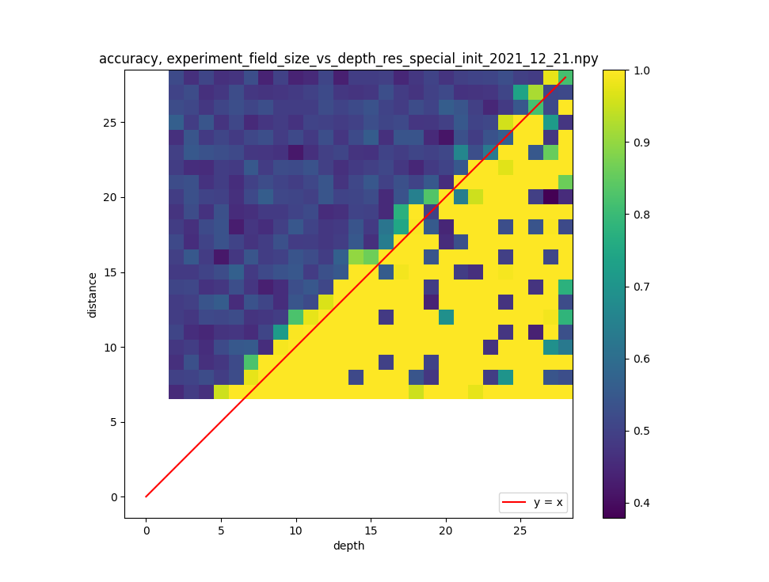  
receptive field size is O(N)  
    
#### 4. Residual connections net, deeper
convolutional layer kernel size: 3x3  
number of intermidiate featuremaps: 16  
is_shifted_init=False  
[experiment_field_size_vs_depth_res.py](../../experiments/experiment_field_size_vs_depth_res.py)    
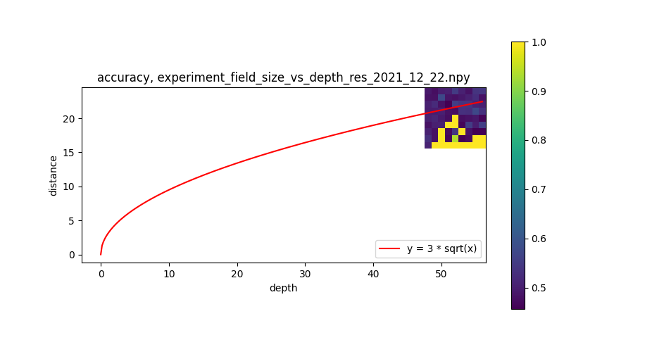  
receptive field size is O(sqrt(N))  
    
#### 5. Get field size by forward pass
[experiment_field_size_by_forward_pass.py](../../experiments/experiment_field_size_by_forward_pass.py)  
convolutional layer kernel size: 3x3  
number of intermidiate featuremaps: 16  
net: NoPoolsNetRes  
is_shifted_init=False  
is_show_field=True  
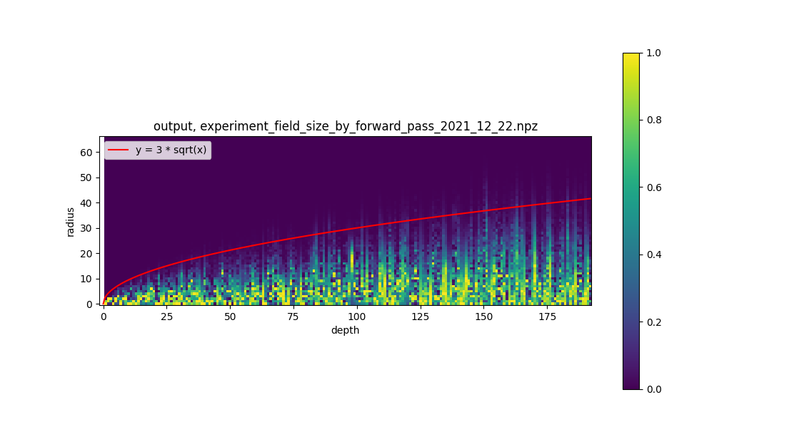  
receptive field size is O(sqrt(N))  
  
#### 6. Get field size by forward pass, constant weights init
[experiment_field_size_by_forward_pass_constant.py](../../experiments/experiment_field_size_by_forward_pass_constant.py)  
convolutional layer kernel size: 3x3  
number of intermidiate featuremaps: 16  
net: NoPoolsNet  
is_constant_init=True   
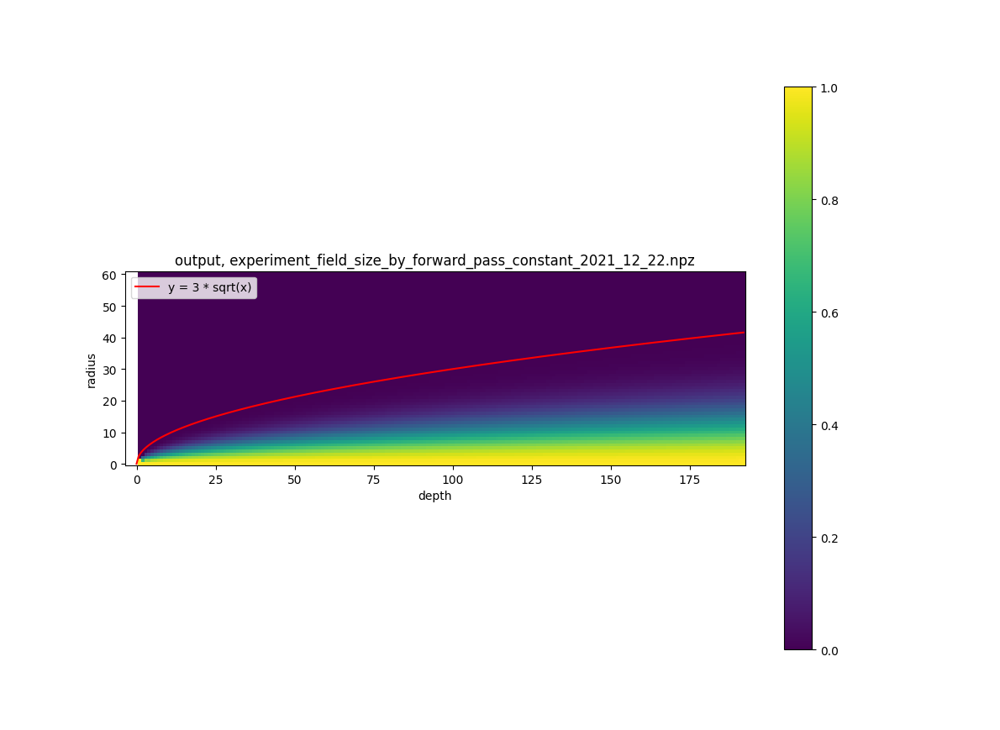  
receptive field size is O(sqrt(N))  
output value along curve y= 3 * sqrt(N):  
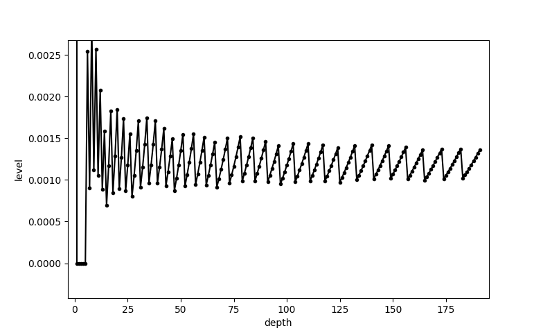  
the value is about 0.0012  
  
#### 7. Decomposed initial condition, field size by forward pass
[experiment_field_size_vs_depth_res_decomposed_init.py](../../experiments/experiment_field_size_vs_depth_res_decomposed_init.py)  
kernel initialized with special values that is decomposition of convolution witch kernel is m x m matrix of ones.     
convolutional layer kernel size: 3x3  
number of intermidiate featuremaps: 16  
[initializers.py/decomposed_init](../../initializers.py#L4)    
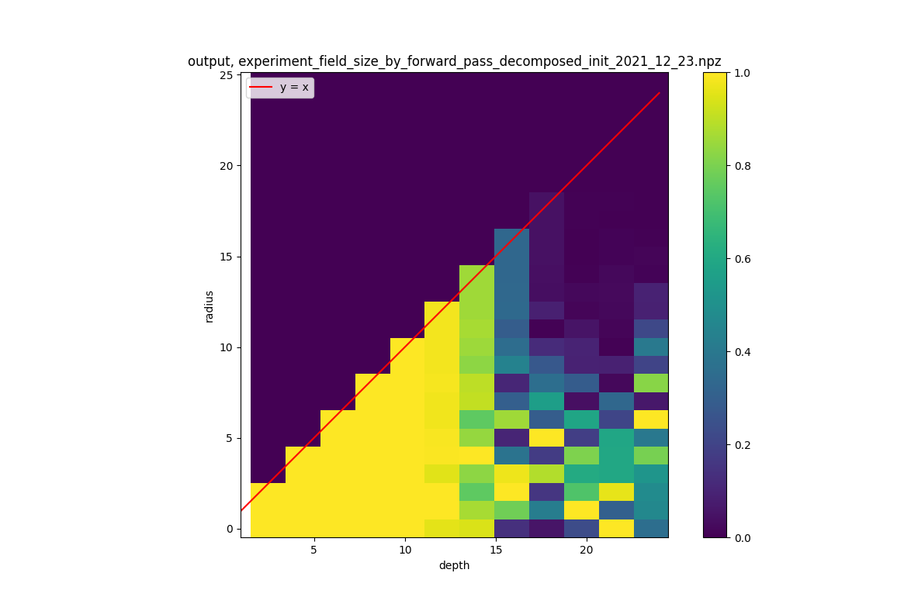    
receptive field size is O(N) until depth = 14  
  
#### 8. Decomposed initial condition
[experiment_field_size_vs_depth_res_decomposed_init.py](../../experiments/experiment_field_size_vs_depth_res_decomposed_init.py)  
convolutional layer kernel size: 3x3  
number of intermidiate featuremaps: 16  
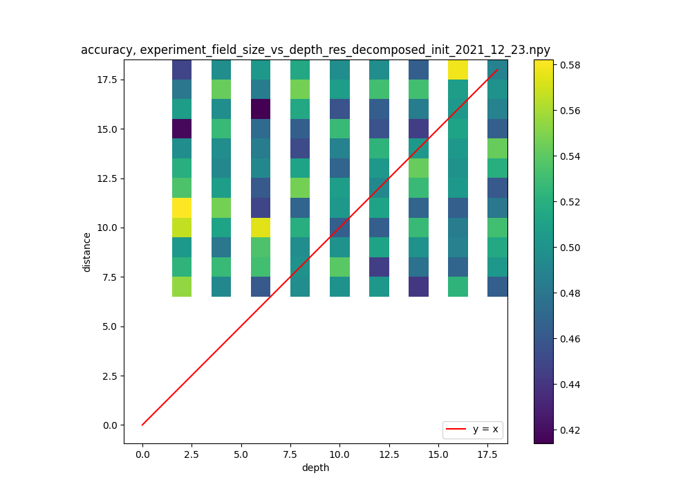  
no recognition at all, all accuracies is about 0.5  
  
#### 9. Circular initial condition
[experiment_field_size_vs_depth_dot_circular.py](../../experiments/experiment_field_size_vs_depth_dot_circular.py)  
convolutional layer kernel size: 3x3  
number of intermidiate featuremaps: 16  
[initializers.py/circular_init](../../initializers.py#L51)  
circular amplitude: 0.2  
angle: 360 degrees  
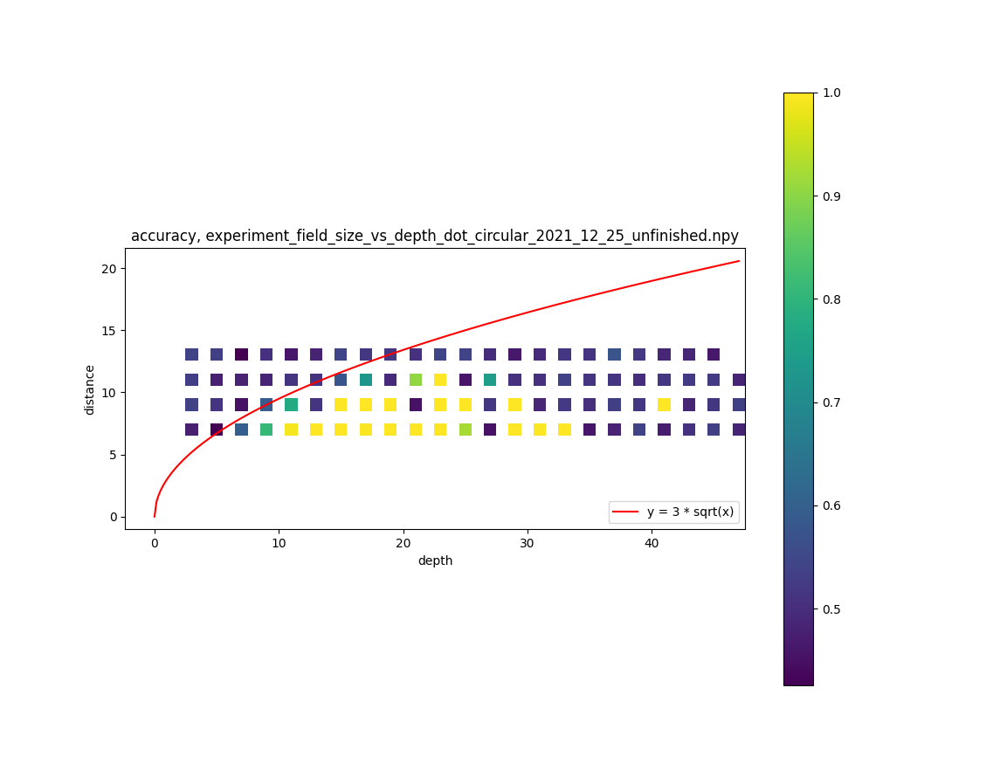   
  
#### 10. Circular initial condition, no circular init condition, just xavier init
[experiment_field_size_vs_depth_dot_circular.py](../../experiments/experiment_field_size_vs_depth_dot_circular.py)  
convolutional layer kernel size: 3x3  
number of intermidiate featuremaps: 16  
angle: 360 degrees  
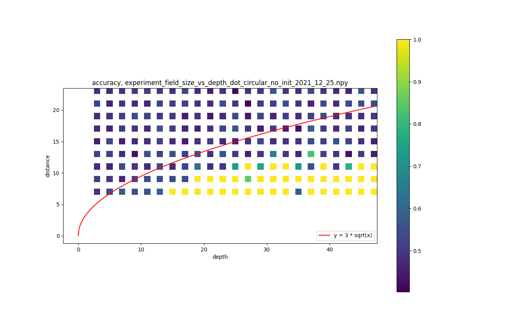  
  
#### 11. Circular initial condition, version 2, 0.6 no circular init condition, just xavier init
[experiment_field_size_vs_depth_dot_circular.py](../../experiments/experiment_field_size_vs_depth_dot_circular.py)  
convolutional layer kernel size: 3x3  
number of intermidiate featuremaps: 16
DECREASE_FACTOR = 0.6  
angle: 360 degrees  
[initializers.py/circular_init_version_2](../../initializers.py#L131)  
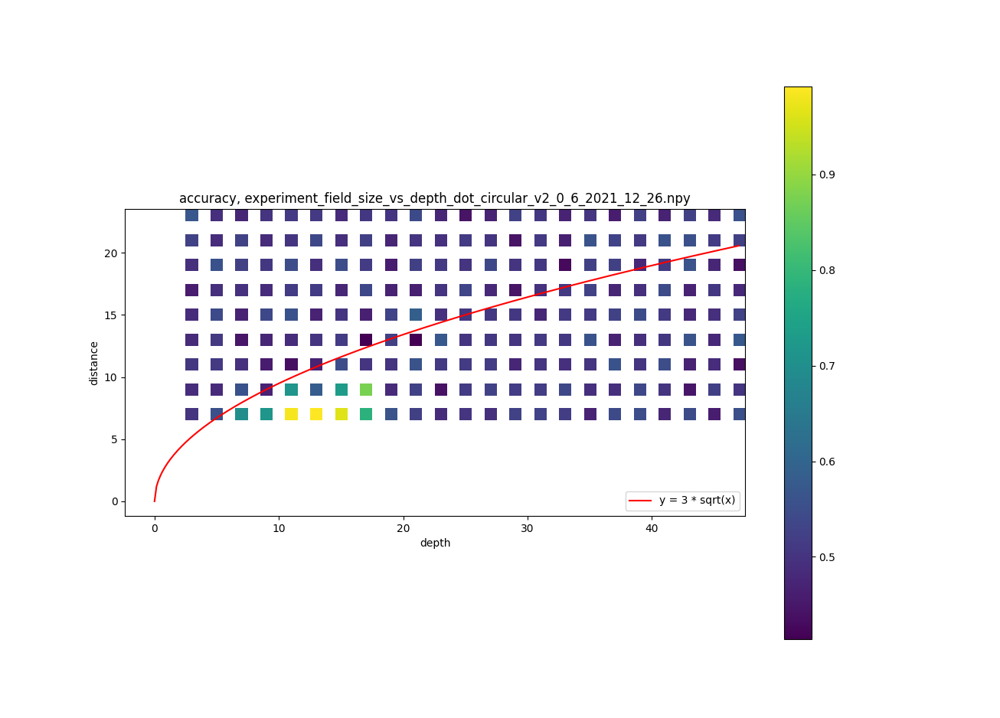  
  
  

